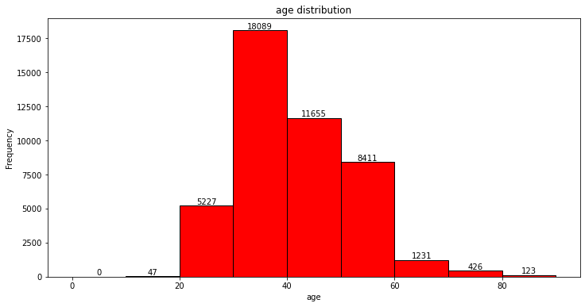
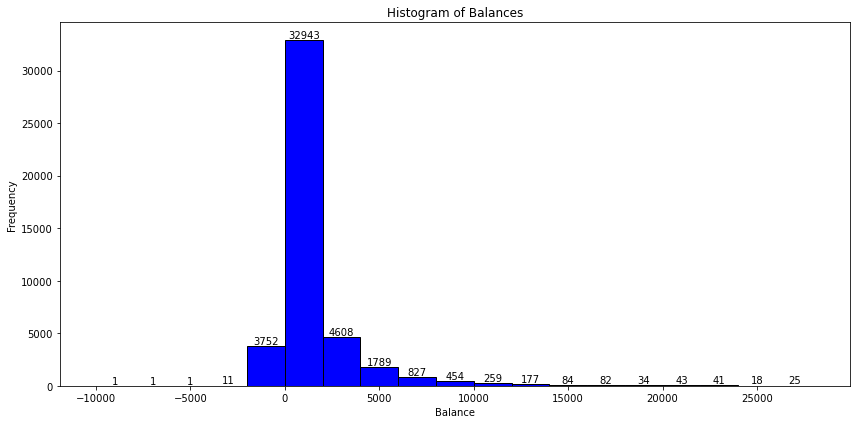
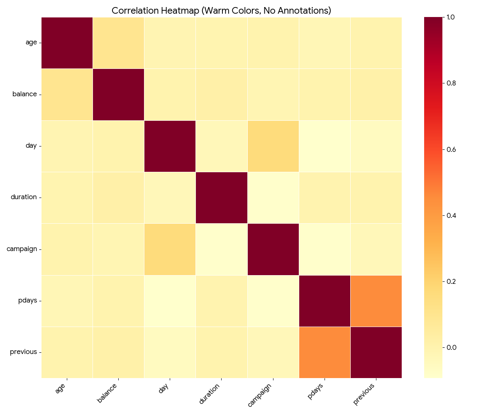

# Banking Data Analysis 📊

## 📌 Project Overview
This project focuses on exploratory data analysis (EDA) of a banking dataset to understand customer demographics, financial behavior, and factors influencing term deposit subscription.

The analysis answers key business questions using statistical summaries and visualizations.

---

## 🎯 Aim of the Project
- Analyze customer demographic distributions (age, job, marital status, education)
- Study financial attributes such as balance, loans, and credit defaults
- Understand campaign effectiveness and client contact patterns
- Identify correlations influencing term deposit subscription

---

## 📂 Dataset Information
- Source: Banking Marketing Dataset
- Records: ~45,000 clients
- Features include age, job, balance, loans, campaign details, and subscription outcome

---

## 📊 Exploratory Data Analysis & Results

### 🔹 Age Distribution of Clients


**Insight:**  
Most clients belong to the 30–50 age group, indicating a working-age customer base.

---

### 🔹 Distribution of Average Yearly Balance


**Statistical Summary:**
- Minimum balance: **-8019**
- Maximum balance: **102127**
- Majority of clients maintain balances between **0–2000**

---

### 🔹 Term Deposit Subscription Correlation


**Key Observations:**
- `duration` shows the strongest positive correlation with subscription
- `pdays` and `previous` have mild positive influence
- `campaign` shows a weak negative correlation

---

## 📈 Key Statistical Findings
- Married clients form the largest customer segment
- Secondary education is the most common education level
- Over **98%** of clients have **no credit default**
- Cellular communication is the dominant campaign channel

---

## 🛠 Tools & Technologies
- Python
- Pandas, NumPy
- Matplotlib, Seaborn
- Jupyter Notebook

---

## 🚀 How to Run the Project
```bash
pip install -r requirements.txt
